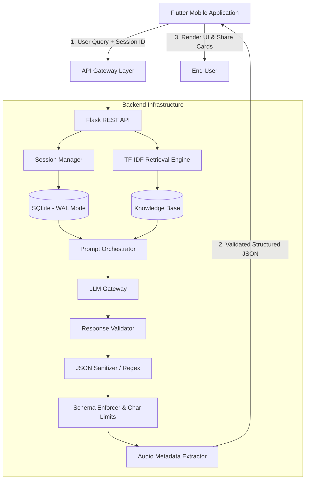

<p align="center">
  <h1 align="center">🧠 Hakim</h1>
  <p align="center"><strong>Advanced AI-Powered Quranic Intelligence Platform</strong></p>
  <p align="center">
    A production-grade platform transforming Quranic verses into structured knowledge, semantic understanding, and practical life guidance through a deterministic multi-stage reasoning pipeline.
  </p>
</p>

<p align="center">
  
  
  
  
  
  
  
</p>

---

## ✨ Overview: Beyond a Simple Wrapper

Hakim is not just an API wrapper around a Large Language Model (LLM). It is a **full-stack AI-powered Quranic intelligence ecosystem**. 

Most AI applications pass raw user input to a model and display the raw text output. This approach is prone to hallucinations, formatting errors, and poor user experience on mobile devices. Hakim solves this by introducing a **deterministic validation and processing pipeline**. Every user request is enriched with local contextual data, and every AI response is strictly validated, sanitized, and transformed into a predictable JSON schema specifically engineered for Flutter UI components.

## 🤖 90% AI-Assisted Engineering

This project serves as a practical demonstration of modern **AI-first software engineering**. Approximately **90% of the codebase, architecture design, and logic implementation** was developed through continuous collaboration with AI models.

**How AI was utilized in this project:**
* **Frontend Generation:** Translating UI mockups into responsive Flutter widgets and managing complex GetX state lifecycles.
* **Backend Logic:** Implementing the Flask controllers, session management, and the lightweight RAG (Retrieval-Augmented Generation) engine.
* **Resilience Engineering:** Designing the `Response Validator` to intercept, parse, and repair broken or malformed JSON generated by the LLM.
* **Prompt Engineering:** Iteratively refining the system prompts to ensure the AI's output exactly matches the strict UI character limits (e.g., preventing text truncation on mobile).

The developer acted as the **Lead Architect**, directing the AI, reviewing code for security and performance, resolving complex integration bugs (like audio file extension conflicts), and managing the deployment infrastructure.

---

## 🚀 Deep Dive: Core Features

### 1. Multi-Layer Quranic Analysis
Hakim breaks down the AI's reasoning into distinct, actionable layers:
* **Linguistic & Etymology:** Analyzes the root words and their semantic evolution.
* **Tafsir & Context:** Provides historical context based on retrieved knowledge base documents.
* **Contemporary Application:** Bridges ancient texts to modern-day psychological and social scenarios.
* **Actionable Strategies:** Gives the user concrete, practical steps derived from the verse.

### 2. Premium Share Card Engine
The platform includes a built-in rendering engine utilizing the Flutter `screenshot` and `share_plus` packages. It allows users to export AI-generated insights as high-resolution graphics.
* **Smart Text Scaling:** The backend strictly limits character counts (`Title: max 35 chars`, `Summary: max 115 chars`) to ensure perfect visual alignment.
* **RTL & Typography:** Full Right-to-Left support with custom Persian/Arabic typography optimized for Instagram Stories and Telegram.

### 3. Fault-Tolerant JSON Sanitization Layer
LLMs notoriously break JSON schemas by adding markdown (e.g., ````json ````), escaping characters incorrectly, or cutting off responses. Hakim's backend features a robust regex-based sanitizer that:
* Strips unwanted markdown.
* Balances broken brackets `{` and `}`.
* Replaces invalid line breaks and sanitizes quotes before parsing.

### 4. Lightweight RAG (Retrieval-Augmented Generation)
Instead of relying on heavy and expensive vector databases (like Pinecone or Milvus), Hakim implements a highly optimized, native **TF-IDF (Term Frequency-Inverse Document Frequency)** scoring engine combined with an **Inverted Index**. 
* It chunks the local `knowledge.txt` file.
* Applies a phrase-matching bonus multiplier (+2.5x) for exact phrase hits.
* Injects the highest-scoring context directly into the LLM prompt.

### 5. Tanzil Audio Link Generator
The AI extracts the specific Surah and Ayah numbers from the context. Hakim uses a dedicated regex pipeline to format this into a valid 6-digit standard (`SSSVVV`) and dynamically generates a direct audio link to the Tanzil network (e.g., `[https://tanzil.net/res/audio/parhizgar/002255.mp3](https://tanzil.net/res/audio/parhizgar/002255.mp3)`).

---

## 🏗 System Architecture & Data Flow



---

## 📂 Project Structure

```text
hakim/
│
├── frontend/
│   ├── lib/
│   │   ├── models/
│   │   ├── repositories/
│   │   ├── services/
│   │   ├── utils/
│   │   ├── viewmodels/
│   │   ├── views/
│   │   └── main.dart
│   │
│   ├── assets/
│   └── pubspec.yaml
│
├── backend/
│   ├── app.py
│   ├── passenger_wsgi.py
│   ├── requirements.txt
│   ├── knowledge.txt
│   └── database/
│
├── docs/
│   └── screenshots/
│
└── README.md
```

---

## 🛠 Tech Stack

### Frontend

* Flutter
* Dart
* GetX
* Screenshot
* Share Plus

### Backend

* Python
* Flask
* SQLite
* Flask-CORS
* dotenv

### Infrastructure

* Linux (Ubuntu)
* cPanel Deployment
* REST API Architecture

---

## 🚀 Installation

### Clone Repository

```bash
git clone https://github.com/amirkhodaei1/smart_chat_bot.git

cd smart_chat_bot
```

### Flutter Setup

```bash
flutter pub get

flutter run
```

### Backend Setup

```bash
cd backend

pip install -r requirements.txt

python app.py
```

---

## ⚙ Environment Variables

Create a `.env` file inside the backend directory:

```env
API_KEY=YOUR_API_KEY
MODEL_NAME=YOUR_MODEL
BASE_URL=YOUR_ENDPOINT
```

---

## 🎯 Design Goals

* Fast and responsive user experience
* Maintainable architecture
* AI-first workflow
* Clean separation of frontend and backend
* Production-ready deployment
* Extensible codebase

---

## 🔮 Roadmap

* Advanced Quran Search
* Verse Cross-Referencing
* Multi-Model AI Support
* User Accounts
* Cloud Synchronization
* Voice Conversations
* Offline Mode
* Enhanced Share Templates

---

## 🤝 Contributing

Contributions, feature requests, and bug reports are welcome.

Feel free to open an issue or submit a pull request.

---

## 📜 License

This project is licensed under the MIT License.

---

<p align="center">
<b>Hakim</b><br>
Where Artificial Intelligence Meets Quranic Wisdom.
</p>

